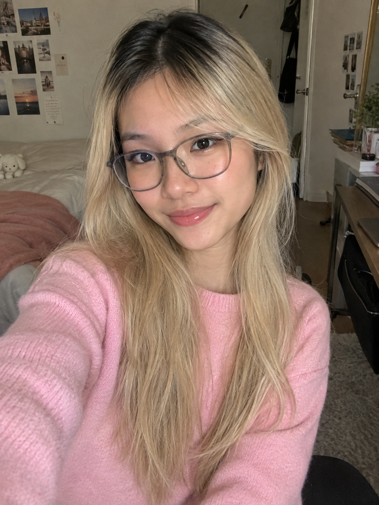

# Week 3 – Selfie & Identity

## The Artifact
This is the image generated by DALL-E 3 (ChatGPT)
This is the first image that get generated based on my description:
This is the second image that get generated based on my descriptive alternations with specific preference (about the scene, facial expression, outfits): 

## Process Notes
Prompt (summary): Create a selfie of myself. I'm an Asian Vietnamese 18 years old. I wear gray glasses. My hair is honey blonde with black and brown roots around 2cm. I'm around 55kg 1m67 and please draw me wearing a pink sweater. 
AI Output: Generated the initial portrait image.
My Contribution: add another prompt: My hair is shorter a little bit but thicker and my glasses is rounder like oval and my cheek is also a little bit rounder and I have dimple and I'm sitting in the classroom.
Notes: I did not upload a real photo of myself to the AI system.

## Reflection
At first, when I asked AI to generate a selfie of me, I did not really see myself in the image. The first result looked like a generic representation of an Asian woman rather than a specific representation of me. It seemed to make assumptions about my facial features, such as giving me monolids, thin lips, or a small, baby-like face. These features made me think about how AI can reproduce common patterns and stereotypes about what an Asian woman is expected to look like, rather than recognizing the uniqueness of an individual person.
I also noticed that the image looked “flawless,” but not necessarily beautiful in a human way. The skin was extremely smooth, almost like a rubber ball, and the delicate facial features made the person feel strangely artificial and distant. After I intervened and edited the image, however, I started to see something that felt more human. I added or preserved small imperfections, such as pores and facial hair, which made the face feel more alive and realistic. Even then, though, I still could not fully see myself in the image. It was closer to me, but it was still shaped by assumptions and patterns learned by the AI.
This experience made me realize that AI can follow our instructions, but it does not necessarily understand our individuality. It recognizes patterns and generates something based on them. Because of that, I think humans should treat AI more as a tool than as a guide. We can intervene, question its assumptions, and reshape its results rather than simply accepting what it produces as a representation of ourselves.

## Attribution & AI Use
- Tools used: DALL-E (via ChatGPT)
- AI prompts (summary): Create a selfie of myself. I'm an Asian Vietnamese 18 years old. I wear gray glasses. My hair is honey blonde with black and brown roots around 2cm. I'm around 55kg 1m67 and please draw me wearing a pink sweater. My hair is shorter a little bit but thicker and my glasses is rounder like oval and my cheek is also a little bit rounder and I have dimple and I'm sitting in the classroom.
- What AI generated: an image of an Asian girl with all the typical Asian feature. She's beautiful but she looks like she has no soul and completely not human-like.
- What you changed or decided: I decided about the main features got showcased, such as the glasses, the weight, the facial expression, the features. I changed about the difference in unique facial features, and add more flaws to make the image looks like a normal people, not some generated lifeless image with ridiculous beauty standard.
